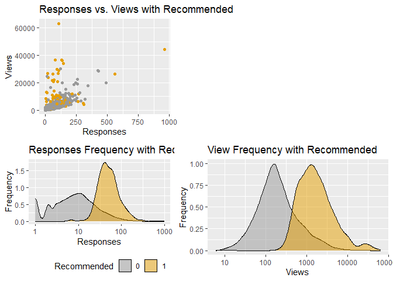
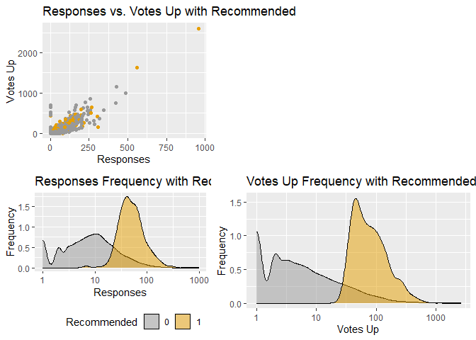
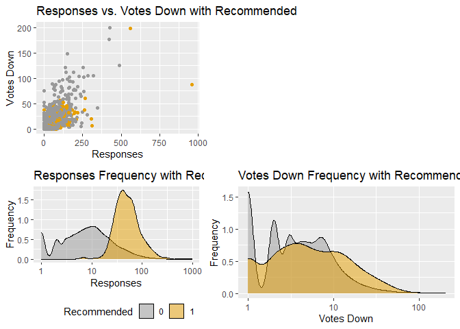
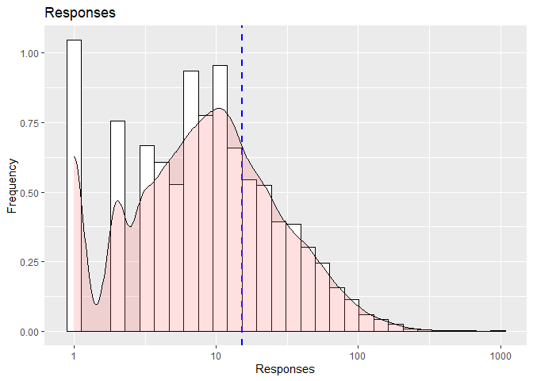
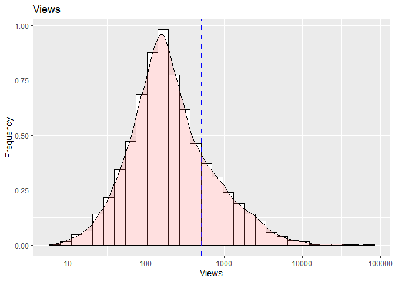
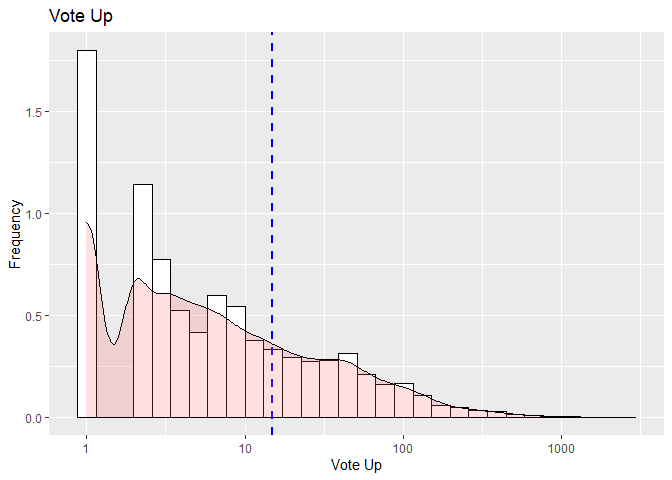
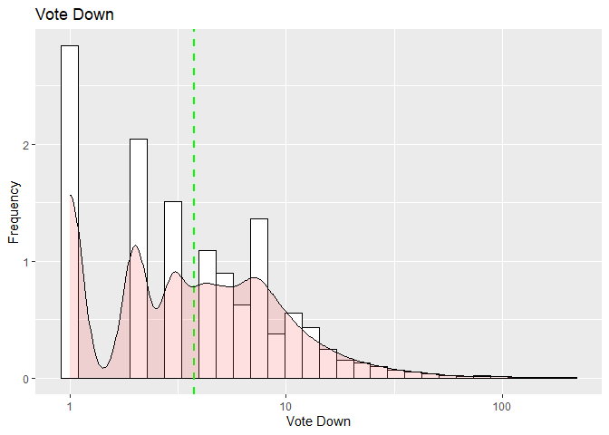
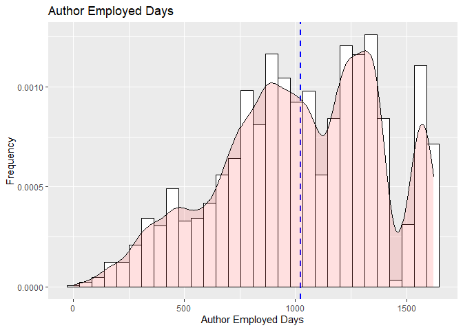
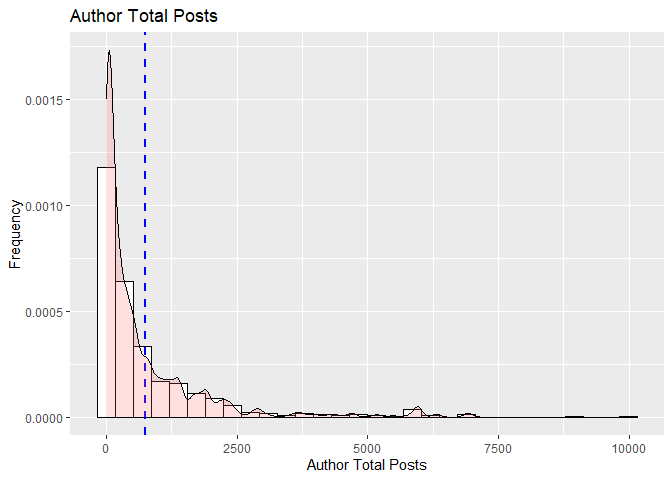

Modeling Quality of Suggestions
================
Yu-Chih (Wisdom) Chen
5/4/2022

-   [Introduction](#introduction)
-   [Data Cleanup & Transformation](#data-cleanup--transformation)
-   [Exploratory Data Analysis (EDA)](#exploratory-data-analysis-eda)
    -   [Training and Testing](#training-and-testing)
-   [Adressing the Unbalanced data
    set](#adressing-the-unbalanced-data-set)
-   [Model Selection and
    Self-Comparison](#model-selection-and-self-comparison)
    -   [Logistic Regression](#logistic-regression)
    -   [Decision Tree](#decision-tree)
    -   [Naive Bayes Model](#naive-bayes-model)
-   [Conclusion](#conclusion)

## Introduction

The goal of this project is to construct various models that could
predict the quality of suggestions made by employees. Our dataset was
‘scraped’ from an online forum of a large human resource company. The
purpose of the forum is to provide a way for employees to give
suggestions to the upper management about a variety of topics. The forum
allows other employees to interact with suggestions made by all
employees. For example, other posters can respond to, vote on, or simply
view the suggestions in the forum. In addition the dataset contains
information about the employee who posted the suggestion, such as their
age and how long the employee has worked at the company (in days).

This report consists of five key sections:

-   Introduction
-   Data Cleanup and Transformation
-   Exploratory Data Analysis
-   Model Selection and Self-Comparison
-   Conclusion

Because the primary task of this analysis centers around model design
and performance, we focused on exploring, tuning and analyzing a variety
of classification methods. This includes logistic regression,
decision-trees, and Naive Bayes. For each method, we included a
confusion matrix, ROC objects and curves, and calculated the AUC, from
which we could extract key performance metrics. As we initially embarked
on this project, we did no assume whether or not certain models would
perform better. Instead, we were interested to see how the different
models would handle this unique data and were curious to see which model
would perform the best.

Before running this file, ensure that the file `suggestions.csv` is in
the same directory as this file.

## Data Cleanup & Transformation

##### We will begin by loading packages that we will need to perform our analysis.

``` r
library(ggplot2)
library(plyr)
library(ISLR)
library(MASS)
library(knitr)
library(rpart)
library(dplyr)
library(partykit)
library(gridExtra)
library(ROSE)
library(caret)
library(rms)
library(ROCR)
library(klaR)
library(unbalanced)
library(pROC)
library(randomForest)
library(mlr)
library(broom)
library(modelr)
options(warn=-1)

cbPalette <- c("#999999", "#E69F00", "#56B4E9", "#009E73", "#F0E442", "#0072B2", "#D55E00", "#CC79A7")

options(scipen = 4)
```

##### Load data

``` r
suggestions <- read.csv("suggestions.csv")
```

``` r
colnames(suggestions)
```

    ##  [1] "Recommended"                                              
    ##  [2] "Suggestion_Id"                                            
    ##  [3] "Responses"                                                
    ##  [4] "Views"                                                    
    ##  [5] "Votes_Up"                                                 
    ##  [6] "Votes_Down"                                               
    ##  [7] "Author_Id"                                                
    ##  [8] "Author_Join..in.terms.of.how.many.days.since.they.joined."
    ##  [9] "Author_TotalPosts"                                        
    ## [10] "Author_PostsPerDay"

``` r
## To check the missing value in data set

sum(is.na(suggestions))
```

    ## [1] 0

<br/> -***Great! The dataset has no missing values.***

## Exploratory Data Analysis (EDA)

``` r
colnames(suggestions)
```

    ##  [1] "Recommended"                                              
    ##  [2] "Suggestion_Id"                                            
    ##  [3] "Responses"                                                
    ##  [4] "Views"                                                    
    ##  [5] "Votes_Up"                                                 
    ##  [6] "Votes_Down"                                               
    ##  [7] "Author_Id"                                                
    ##  [8] "Author_Join..in.terms.of.how.many.days.since.they.joined."
    ##  [9] "Author_TotalPosts"                                        
    ## [10] "Author_PostsPerDay"

``` r
# The 8th column name is especially large
names(suggestions)[names(suggestions) == "Author_Join..in.terms.of.how.many.days.since.they.joined."] <- "Author_emplyd_days"

colnames(suggestions)
```

    ##  [1] "Recommended"        "Suggestion_Id"      "Responses"         
    ##  [4] "Views"              "Votes_Up"           "Votes_Down"        
    ##  [7] "Author_Id"          "Author_emplyd_days" "Author_TotalPosts" 
    ## [10] "Author_PostsPerDay"

<br/> -***We have 9 predictor variables to work with in terms of
predicting which suggestions will be
Recommended.<br/>`Author_Join..in.terms.of.how.many.days.since.they.joined.`
is a very long variable name, we chose to rename it to
`Author_emplyd_days` to shorten the name.***

<br/> -***We expect that there may collinearity between some of these
variables, such as `Author_emplyd_days` and `Author_PostsPerDay`. We
will look at potential collinearity as a part of our EDA.***

``` r
table(suggestions$Recommended)
```

    ## 
    ##     0     1 
    ## 15867   562

<br/> -***This is clearly an unbalanced distribution. Most of the
suggestions were not recommended. We will need to address this prior to
training models.***

##### Checking for Collinearity

``` r
# checking for correlation
suggestion_vars <-c("Suggestion_Id" , "Responses" , "Views" , "Votes_Up", "Votes_Down" , "Author_Id" , "Author_emplyd_days" , "Author_TotalPosts" , "Author_PostsPerDay")                                                       

#version w/ only plots
#pairs(bikes[,bike_vars])

panel.cor <- function(x, y, digits = 2, prefix = "", cex.cor, ...)
{
    usr <- par("usr"); on.exit(par(usr))
    par(usr = c(0, 1, 0, 1))
    r <- abs(cor(x, y))
    txt <- format(c(r, 0.123456789), digits = digits)[1]
    txt <- paste0(prefix, txt)
    if(missing(cex.cor)) cex.cor <- 0.8/strwidth(txt)
    text(0.5, 0.5, txt, cex = pmax(1, cex.cor * r))
}

pairs(suggestions[,suggestion_vars],lower.panel = panel.cor)
```

<!-- --> <br/> -***There are
several variables that are correlated to each other. <br/> The most
correlated variables at 99% are `Author_Id` and `Author_emplyd_days`.
This is not especially interesting as these values will always match for
every employee. <br/> Naturally, we see that `Author_TotalPosts` and
`Author_PostsPerDay` are highly correlated, at 93%. Since one is an
average, we likely will not want to include both of these variables. We
will need to determine which variable is more significant.
Alternatively, we can keep both variables in the model ans see how they
affect the performance of the model and their significance.<br/>
`Votes_Down` and `Author_Id` have a correlation of 89%. This indicates a
variable that may be useful in our analysis. Maybe the suggestions of
certain employees do not match the views of other employees.***

##### Correlation Plots

\-***In this section we will take a closer look and “zoom in” at the
correlations between a select few variables.***

<br/> - ***As `Author_ID` and `Suggestion_ID` are unique values, we have
chosen not to create correlation plots for these variables.***

``` r
# Perform `Response` vs `Views`

ggplot(suggestions, aes(x = Responses, y = Views)) + 
    annotate(x = 500, y = 40000, 
         label=paste("Correlation = ", round(cor(suggestions$Responses, suggestions$Views),2)), 
         geom = "text", size = 5)+
  labs(title = "Responses vs. Views Correlations", y = "Views", x = "Responses")+
  geom_point()+
  geom_smooth(method = lm)
```

    ## `geom_smooth()` using formula 'y ~ x'

<!-- -->
<br/> -***The plot above indicates that `Views` and `Responses` have a
70% correlation rate, which means they are highly correlated.***

``` r
# Perform `Responses` vs. `Votes_Up`

ggplot(suggestions, aes(x = Responses, y = Votes_Up)) + 
      annotate(x = 250, y = 2000, 
         label=paste("Correlation = ", round(cor(suggestions$Responses, suggestions$Votes_Up),2)), 
         geom = "text", size = 5)+
  labs(title = "Responses vs. Votes Up Correlations", y = "Votes Up", x = "Responses")+
  geom_point()+
  geom_smooth(method = lm)
```

    ## `geom_smooth()` using formula 'y ~ x'

<!-- -->
<br/> -***The plot above indicates that `Votes_Up` and `Responses` have
a 85% correlation rate, which means they are highly correlated.***

``` r
# Perform `Responses` vs. `Votes_Down`

ggplot(suggestions, aes(x = Responses, y = Votes_Down)) + 
        annotate(x = 250, y = 150, 
         label=paste("Correlation = ", round(cor(suggestions$Responses, suggestions$Votes_Down),2)), 
         geom = "text", size = 5)+
  labs(title = "Responses vs. Votes Down Correlation", y = "Votes Down", x = "Responses")+
  geom_point()+
  geom_smooth(method = lm)
```

    ## `geom_smooth()` using formula 'y ~ x'

<!-- -->
<br/> -***The plot above indicates that `Votes_Down` and `Responses`
have a 69% correlation rate, which means they are moderately correlated-
if we consider anything 70% and above as highly correlated. They are
less correlated than `Votes_Up` and `Responses` though.***

``` r
# Perform `Views` vs. `Votes_Up`

ggplot(suggestions, aes(x = Views, y = Votes_Up)) + 
          annotate(x = 15000, y = 1500, 
         label=paste("Correlation = ", round(cor(suggestions$Views, suggestions$Votes_Up),2)), 
         geom = "text", size = 5)+
  labs(title = "Views vs. Votes Up correlations", y = "Votes Up", x = "Views")+
  geom_point()+
  geom_smooth(method = lm)
```

    ## `geom_smooth()` using formula 'y ~ x'

<!-- --> <br/>
-***The plot above indicates that `Votes_Up` and `Views` have a 67%
correlation rate, which means they are moderately correlated.***

##### Density Plots

``` r
plot_2 <- ggplot(suggestions, aes(x = Author_emplyd_days, fill = as.factor(Recommended))) + 
  geom_density(alpha=.5) + 
  scale_x_log10()+
  labs(fill='Recommended')+
  scale_fill_manual(values = c('#999999','#E69F00')) +
  labs(title = "Tenure Frequency of Recommended", y = "Frequency", x = "Tenure (days)")+
  theme(legend.position = "bottom",
    legend.justification = c("right", "top"),
    legend.box.just = "right")

plot_2
```

<!-- -->

``` r
tenure_rec <- round(mean(suggestions$Author_emplyd_days[suggestions$Recommended>0]),3)
tenure_nonrec <- round(mean(suggestions$Author_emplyd_days[suggestions$Recommended<1]),3)

print(paste("The average tenure of recommended suggestions is: ", tenure_rec))
```

    ## [1] "The average tenure of recommended suggestions is:  1172.801"

``` r
print(paste("The average tenure of suggestions that were not recommended is: ", tenure_nonrec))
```

    ## [1] "The average tenure of suggestions that were not recommended is:  1016.846"

<br/> -***The plot above indicates that age/tenure does matter when it
comes to an employee’s ability to make a good suggestion. As the text
output along with the plot indicates, it appears that employees with
longer tenures make better suggestions than those with shorter ones. ***

``` r
plot_1 <- ggplot(suggestions,aes(x = Author_TotalPosts, y = Author_PostsPerDay, color = as.factor(Recommended))) + 
  geom_point() + 
  labs(title = "Author Total Posts vs. Author Posts Per Day with Reommended", y = "Author Posts Per Day", x = "Author Total Posts")+
  scale_color_manual(values = c('#999999','#E69F00')) + 
  theme(legend.position = "none")


plot_2 <- ggplot(suggestions, aes(x = Author_TotalPosts, fill = as.factor(Recommended))) + 
  geom_density(alpha=.5) + 
  scale_x_log10()+
  labs(fill='Recommended')+
  scale_fill_manual(values = c('#999999','#E69F00')) +
  labs(title = "Author Total Posts Frequency with Recommended", y = "Frequency", x = "Author Total Posts")+
  theme(legend.position = "bottom",
    legend.justification = c("right", "top"),
    legend.box.just = "right")


plot_3 <- ggplot(suggestions, aes( x = Author_PostsPerDay, fill = as.factor(Recommended))) + 
  geom_density(alpha=.5) + 
  scale_x_log10()+
  scale_fill_manual(values = c('#999999','#E69F00')) +
  labs(title = "Author Posts Pre Day Frequency with Recommended", y = "Frequency", x = "Responses")+
  theme(legend.position = "none")


blankPlot <- ggplot()+geom_blank(aes(1,1))+
  theme(plot.background = element_blank(), 
   panel.grid.major = element_blank(),
   panel.grid.minor = element_blank(), 
   panel.border = element_blank(),
   panel.background = element_blank(),
   axis.title.x = element_blank(),
   axis.title.y = element_blank(),
   axis.text.x = element_blank(), 
   axis.text.y = element_blank(),
   axis.ticks = element_blank()
     )


grid.arrange(plot_1, blankPlot, plot_2, plot_3, 
        ncol=2, nrow=2, widths=c(4, 5), heights=c(4, 4))
```

<!-- --> <br/> -***Based on
“Author_TotalPosts” density plot,with recommended is skewed left, which
means it is not normal distribution, and without recommended, it is more
better normal distributed than with recommended. On the other hand,
based on “Author_PostsPerDay”, with recommended has better normal
distributed than without recommended, which means without recommended
has right skewed.***

``` r
plot_4 <- ggplot(suggestions,aes(x = Responses, y = Views, color = as.factor(Recommended))) + 
  geom_point() + 
  scale_color_manual(values = c('#999999','#E69F00')) + 
  labs(title = "Responses vs. Views with Recommended", y = "Views", x = "Responses")+
  theme(legend.position = "none")


plot_5 <- ggplot(suggestions, aes(x = Responses, fill = as.factor(Recommended))) + 
  geom_density(alpha=.5) + 
  scale_fill_manual(values = c('#999999','#E69F00')) + 
  scale_x_log10()+
  labs(fill='Recommended')+
  labs(title = "Responses Frequency with Recommended", y = "Frequency", x = "Responses")+
  scale_fill_manual(values = c('#999999','#E69F00')) + 
  theme(legend.position = "bottom",
    legend.justification = c("right", "top"),
    legend.box.just = "right")
```

    ## Scale for 'fill' is already present. Adding another scale for 'fill', which
    ## will replace the existing scale.

``` r
plot_6 <- ggplot(suggestions, aes( x = Views, fill = as.factor(Recommended))) + 
  geom_density(alpha=.5) + 
  scale_fill_manual(values = c('#999999','#E69F00')) + 
  labs(title = "View Frequency with Recommended", y = "Frequency", x = "Views")+
  scale_x_log10()+
  theme(legend.position = "none")


blankPlot_1 <- ggplot()+geom_blank(aes(1,1))+
  theme(plot.background = element_blank(), 
   panel.grid.major = element_blank(),
   panel.grid.minor = element_blank(), 
   panel.border = element_blank(),
   panel.background = element_blank(),
   axis.title.x = element_blank(),
   axis.title.y = element_blank(),
   axis.text.x = element_blank(), 
   axis.text.y = element_blank(),
   axis.ticks = element_blank()
     )


grid.arrange(plot_4, blankPlot_1, plot_5, plot_6, 
        ncol=2, nrow=2, widths=c(4, 5), heights=c(4, 4))
```

<!-- --> <br/> -***Based on
“Responses” density plot, with recommended is a normal distribution.,
which is better than without recommended. On the other hand, based on
“Vies” density plot, both with recommended and without recommended are
normal distribution.***

``` r
plot_7 <- ggplot(suggestions,aes(x = Responses, y = Votes_Up, color = as.factor(Recommended))) + 
  geom_point() + 
  labs(title = "Responses vs. Votes Up with Recommended", y = "Votes Up", x = "Responses")+
  scale_color_manual(values = c('#999999','#E69F00')) + 
  theme(legend.position = "none")


plot_8 <- ggplot(suggestions, aes(x = Responses, fill = as.factor(Recommended))) + 
  geom_density(alpha=.5) + 
  scale_fill_manual(values = c('#999999','#E69F00')) + 
  scale_x_log10()+
  labs(fill='Recommended')+
  labs(title = "Responses Frequency with Reommended", y = "Frequency", x = "Responses")+
  scale_fill_manual(values = c('#999999','#E69F00')) + 
  theme(legend.position = "bottom",
    legend.justification = c("right", "top"),
    legend.box.just = "right")
```

    ## Scale for 'fill' is already present. Adding another scale for 'fill', which
    ## will replace the existing scale.

``` r
plot_9 <- ggplot(suggestions, aes( x = Votes_Up, fill = as.factor(Recommended))) + 
  geom_density(alpha=.5) + 
  scale_fill_manual(values = c('#999999','#E69F00')) + 
  labs(title = "Votes Up Frequency with Recommended", y = "Frequency", x = "Votes Up")+
  scale_x_log10()+
  theme(legend.position = "none")


blankPlot_2 <- ggplot()+geom_blank(aes(1,1))+
  theme(plot.background = element_blank(), 
   panel.grid.major = element_blank(),
   panel.grid.minor = element_blank(), 
   panel.border = element_blank(),
   panel.background = element_blank(),
   axis.title.x = element_blank(),
   axis.title.y = element_blank(),
   axis.text.x = element_blank(), 
   axis.text.y = element_blank(),
   axis.ticks = element_blank()
     )


grid.arrange(plot_7, blankPlot_2, plot_8, plot_9, 
        ncol=2, nrow=2, widths=c(4, 5), heights=c(4, 4))
```

<!-- -->

<br/> -***Based on “Responses” density plot, with recommended is a
normal distribution., which is better than without recommended. On the
other hand, based on “Votes_up” density plot, with recommended seems
like normal distribution, but without recommended is skewed right
distribution.***

``` r
plot_10 <- ggplot(suggestions,aes(x = Responses, y = Votes_Down, color = as.factor(Recommended))) + 
  geom_point() + 
  labs(title = "Responses vs. Votes Down with Recommended", y = "Votes Down", x = "Responses")+
  scale_color_manual(values = c('#999999','#E69F00')) + 
  theme(legend.position = "none")


plot_11 <- ggplot(suggestions, aes(x = Responses, fill = as.factor(Recommended))) + 
  geom_density(alpha=.5) + 
  scale_fill_manual(values = c('#999999','#E69F00')) + 
  scale_x_log10()+
  labs(fill='Recommended')+
  labs(title = "Responses Frequency with Recommended", y = "Frequency", x = "Responses")+
  scale_fill_manual(values = c('#999999','#E69F00')) + 
  theme(legend.position = "bottom",
    legend.justification = c("right", "top"),
    legend.box.just = "right")
```

    ## Scale for 'fill' is already present. Adding another scale for 'fill', which
    ## will replace the existing scale.

``` r
plot_12 <- ggplot(suggestions, aes(x = Votes_Down, fill = as.factor(Recommended))) + 
  geom_density(alpha=.5) + 
  scale_fill_manual(values = c('#999999','#E69F00')) + 
  labs(title = "Votes Down Frequency with Recommended", y = "Frequency", x = "Votes Down")+
  scale_x_log10()+
  theme(legend.position = "none")


blankPlot_3 <- ggplot()+geom_blank(aes(1,1))+
  theme(plot.background = element_blank(), 
   panel.grid.major = element_blank(),
   panel.grid.minor = element_blank(), 
   panel.border = element_blank(),
   panel.background = element_blank(),
   axis.title.x = element_blank(),
   axis.title.y = element_blank(),
   axis.text.x = element_blank(), 
   axis.text.y = element_blank(),
   axis.ticks = element_blank()
     )


grid.arrange(plot_10, blankPlot_3, plot_11, plot_12, 
        ncol=2, nrow=2, widths=c(4, 5), heights=c(4, 4))
```

<!-- --> <br/> -***Based on
“Responses” density plot, with recommended is a normal distribution.,
which is better than without recommended. On the other hand, based on
“Votes_down” density plot, both with recommended and without recommend
are seems to skewed right distribution.***

``` r
plot_13 <- ggplot(suggestions,aes(x = Views, y = Votes_Up, color = as.factor(Recommended))) + 
  geom_point() + 
  labs(title = "Views vs. Votes Up with Recommended", y = "Votes Up", x = "Views")+
  scale_color_manual(values = c('#999999','#E69F00')) + 
  theme(legend.position = "none")


plot_14 <- ggplot(suggestions, aes(x = Views, fill = as.factor(Recommended))) + 
  geom_density(alpha=.5) + 
  scale_fill_manual(values = c('#999999','#E69F00')) + 
  scale_x_log10()+
  labs(fill='Recommended')+
  labs(title = "Views Frequency with Recommended", y = "Frequency", x = "Views")+
  scale_fill_manual(values = c('#999999','#E69F00')) + 
  theme(legend.position = "bottom",
    legend.justification = c("right", "top"),
    legend.box.just = "right")
```

    ## Scale for 'fill' is already present. Adding another scale for 'fill', which
    ## will replace the existing scale.

``` r
plot_15 <- ggplot(suggestions, aes(x = Votes_Up, fill = as.factor(Recommended))) + 
  scale_x_log10()+
  geom_density(alpha=.5) + 
  labs(title = "Votes Up Frequency with Recommended", y = "Frequency", x = "Votes Up")+
  scale_fill_manual(values = c('#999999','#E69F00')) + 
  theme(legend.position = "none")


blankPlot_4 <- ggplot()+geom_blank(aes(1,1))+
  theme(plot.background = element_blank(), 
   panel.grid.major = element_blank(),
   panel.grid.minor = element_blank(), 
   panel.border = element_blank(),
   panel.background = element_blank(),
   axis.title.x = element_blank(),
   axis.title.y = element_blank(),
   axis.text.x = element_blank(), 
   axis.text.y = element_blank(),
   axis.ticks = element_blank()
     )


grid.arrange(plot_13, blankPlot_3, plot_14, plot_15, 
        ncol=2, nrow=2, widths=c(4, 5), heights=c(4, 4))
```

<!-- --> <br/> -***Based on
“Views” density plot, both recommended and without recommend are normal
distribution. On the other hand, based on “Votes_up” density plot, with
recommended seems like normal distribution, but without recommended is
skewed right distribution..***

``` r
Resp <- 
  ggplot(suggestions, aes(x = Responses)) + 
  geom_histogram(aes(y=..density..), colour="black", fill="white")+
  scale_x_log10()+
  geom_vline(aes(xintercept = mean(Responses)), color = "blue", linetype = "dashed", size = 1)+
  labs(title = "Responses", y = "Frequency", x = "Responses")+
  geom_density(alpha=.2, fill="#FF6666") 

Resp
```

    ## `stat_bin()` using `bins = 30`. Pick better value with `binwidth`.

<!-- --> <br/> -***The plot
above illustrates that the `Responses` variable has a right skewed
distribution, which means the mean is greater than median.***

``` r
Plot_Views <- 
  ggplot(suggestions, aes(x = Views)) + 
  geom_histogram(aes(y=..density..), colour="black", fill="white")+
  scale_x_log10()+
  geom_vline(aes(xintercept = mean(Views)), color = "blue", linetype = "dashed", size = 1)+
  labs(title = "Views", y = "Frequency", x = "Views")+
  geom_density(alpha=.2, fill="#FF6666") 

Plot_Views
```

    ## `stat_bin()` using `bins = 30`. Pick better value with `binwidth`.

<!-- -->

``` r
summary(suggestions$Views)
```

    ##    Min. 1st Qu.  Median    Mean 3rd Qu.    Max. 
    ##     0.0    94.0   180.0   520.5   409.0 63243.0

<br/> –***The plot above illustrates that the `Views` variable seems
like normal distribution, but based on statistics summary the mean is
larger tahn median, which means it is right skewed.***

``` r
Plot_Vote_up <- 
  ggplot(suggestions, aes(x = Votes_Up)) + 
  geom_histogram(aes(y=..density..), colour="black", fill="white")+
  scale_x_log10()+
  geom_vline(aes(xintercept = mean(Votes_Up)), color = "blue", linetype = "dashed", size = 1)+
  labs(title = "Vote Up", y = "Frequency", x = "Vote Up")+
  geom_density(alpha=.2, fill="#FF6666") 

Plot_Vote_up
```

    ## `stat_bin()` using `bins = 30`. Pick better value with `binwidth`.

<!-- --> <br/> - ***The
plot above illustrates that the `Votes_Up` variable has an extremely
right skewed distribution, which means the mean is greater than median.
This also shows that many posts were not voted up.***

``` r
Plot_Vote_down <- 
  ggplot(suggestions, aes(x = Votes_Down)) + 
  geom_histogram(aes(y=..density..), colour="black", fill="white")+
  geom_vline(aes(xintercept = mean(Votes_Down)), color = "green", linetype = "dashed", size = 1)+
  labs(title = "Vote Down", y = "Frequency", x = "Vote Down")+
  scale_x_log10()+
  geom_density(alpha=.2, fill="#FF6666") 

Plot_Vote_down
```

    ## `stat_bin()` using `bins = 30`. Pick better value with `binwidth`.

<!-- --> <br/> – ***The
plot above illustrates that the `Votes_Down` variable has a right skewed
distribution, which means the mean is greater than median. This also
shows that most posts were not voted down very often. In combination
with the previous plot, this may indicate than the vote up and vote down
feature is not utilized very often.***

``` r
plot_emplyd_days <- 
  ggplot(suggestions, aes(x = Author_emplyd_days)) + 
  geom_histogram(aes(y=..density..), colour="black", fill="white")+
  geom_vline(aes(xintercept = mean(Author_emplyd_days)), color = "blue", linetype = "dashed", size = 1)+
  labs(title = "Author Employed Days", y = "Frequency", x = "Author Employed Days")+
  geom_density(alpha = 0.2, fill="#FF6666") 

plot_emplyd_days
```

    ## `stat_bin()` using `bins = 30`. Pick better value with `binwidth`.

<!-- -->

``` r
summary(suggestions$Author_emplyd_days)
```

    ##    Min. 1st Qu.  Median    Mean 3rd Qu.    Max. 
    ##       4     774    1035    1022    1298    1624

<br/> - ***The histogram produced on `Author_emplyd_days` makes it hard
to determine if it has normal distribution or not, so we need to use the
“Summary” to perform this variable basic statistic. Thus, we can see
that median is slightly larger than mean, which is left skewed. We can
also see that there is a wide range in terms of how long employees have
been with the company.***

``` r
Plot_auth_posts <- 
  ggplot(suggestions, aes(x = Author_TotalPosts)) + 
  geom_histogram(aes(y=..density..), colour="black", fill="white")+
  geom_vline(aes(xintercept = mean(Author_TotalPosts)), color = "blue", linetype = "dashed", size = 1)+
  labs(title = "Author Total Posts", y = "Frequency", x = "Author Total Posts")+
  geom_density(alpha=.2, fill="#FF6666") 

Plot_auth_posts
```

    ## `stat_bin()` using `bins = 30`. Pick better value with `binwidth`.

<!-- -->

``` r
summary(suggestions$Author_TotalPosts)
```

    ##    Min. 1st Qu.  Median    Mean 3rd Qu.    Max. 
    ##     1.0    57.0   286.0   746.5   909.0  9992.0

<br/> -***The plot above illustrates that the `Author_TotalPosts`
variable has a right skewed distribution, which means the mean is
greater than median. Compared to the other variables, we can see a wider
distribution for this variable.***

``` r
library(corrplot)
```

    ## corrplot 0.92 loaded

``` r
df_1 <- select(suggestions, -Recommended)

correlations <- cor(df_1, use = "pairwise.complete.obs")

corrplot(correlations, diag = FALSE, type = "upper", t1.cex = 0.6)
```

<!-- -->
<br/> -***There are several of the original predictors were almost
perfectly collinear or non-collinear. In particular, indicators related
to “Author Total Posts”, “Votes Up”, “Votes Down”, “Views”, and
“Responses” were all strongly corelated with one another. But we cannot
count the “Author ID” because this is a unique variable. However, if we
want to use regression method to build the machine learning model, we
need to check whether the variables has multi-collinearity because if
they are multi-collinearity, then independent variable can be predicted
from another independent variable in a regression model, it will cause
high R-squared. In other words, this is not appropriate to predict our
data-set. Thus, we need to use variance inflation factor to select which
variables are more appropriate in our linear models***

``` r
# Number of Distinct Authohr_Id

Distinct_Author<-
suggestions %>%
  group_by(Author_Id) %>%
  summarise(count=n()) %>%
  arrange(desc(count))

print(Distinct_Author)
```

    ## # A tibble: 4,692 x 2
    ##    Author_Id count
    ##        <int> <int>
    ##  1    292847   197
    ##  2    394835   159
    ##  3    478933   120
    ##  4    312685   108
    ##  5    992971    85
    ##  6    550387    77
    ##  7     36710    75
    ##  8    845514    73
    ##  9   1143837    70
    ## 10    905707    69
    ## # ... with 4,682 more rows

<br/> -***The table above indicates that `Author_ID` `292847` has
generated the most amount of suggestions.***

``` r
rankings <- table(suggestions$Author_Id, suggestions$Recommended)
rankings <- data.frame(unclass(rankings))
rankings <- rename(rankings, not_rec = X0)
rankings <- rename(rankings, rec = X1)
rankings$total_sug <- with(rankings, not_rec + rec)
rankings$frac_rec <- with(rankings, rec / total_sug)

rankings <- rankings[order(-rankings$frac_rec, -rankings$rec), ]
head(rankings,20)
```

    ##         not_rec rec total_sug  frac_rec
    ## 268571        0   3         3 1.0000000
    ## 206577        0   2         2 1.0000000
    ## 1764          0   1         1 1.0000000
    ## 47044         0   1         1 1.0000000
    ## 50389         0   1         1 1.0000000
    ## 75427         0   1         1 1.0000000
    ## 144806        0   1         1 1.0000000
    ## 274939        0   1         1 1.0000000
    ## 294532        0   1         1 1.0000000
    ## 310661        0   1         1 1.0000000
    ## 413317        0   1         1 1.0000000
    ## 418180        0   1         1 1.0000000
    ## 493296        0   1         1 1.0000000
    ## 532759        0   1         1 1.0000000
    ## 597820        0   1         1 1.0000000
    ## 647117        0   1         1 1.0000000
    ## 686450        0   1         1 1.0000000
    ## 885075        0   1         1 1.0000000
    ## 1430893       0   1         1 1.0000000
    ## 202713        1   2         3 0.6666667

<br/> -***The table above ranks all `Author_ID`s by the fraction of
every Author’s suggestions that were recommended. We calculated this by
dividing the amount of recommended suggestions every author had by the
amount of total suggestions that author made. The table is sorted to
show the`Author_ID`’s with the highest fraction of recommended
suggestions. If any `Author_ID`s have the same rate, the table is then
sorted to show the `Author_ID` with the highest total number of
suggestions first. This table is insightful as it shows which employees
have a better rankings, and which employees are more likely to make good
suggestions. This is more insightful than the previous table above,
because even though an employee makes a lot of suggestions, that does
not mean they are quality suggestions. This table, resolves that to rank
employees on the quality of their suggestions rather than the quantity
of suggestions.***

<br/> -***These rankings can identify groups of employees whose
suggestions could be aggregated to provide more reliable suggestions
than made by the best individuals. These groups can be created by any
metric we have access to.***

<br/> ***Please note that we choose to only show the top 20
`Author_ID`s, however the table has all `Author_ID`s.***

``` r
# Perform the proportion of with recommended and without recommended

sug_freq <- 
  suggestions %>%
    group_by(Recommended) %>%
    summarise(n = n()) %>%
    mutate(Freq = n/sum(n))

print(sug_freq)
```

    ## # A tibble: 2 x 3
    ##   Recommended     n   Freq
    ##         <int> <int>  <dbl>
    ## 1           0 15867 0.966 
    ## 2           1   562 0.0342

<br/> -***It obvious that without recommended has larger proportion than
with Recommended.***

``` r
recomm_data <- suggestions %>%
  count(Recommended) %>%
  arrange(desc(Recommended)) %>%
  mutate(prop = round(n*100/sum(n), 1),
         lab.ypos = cumsum(prop) - 0.5*prop)

mycols1 <- c("#E69F00", "#999999")

recomm_1 <- 
  ggplot(recomm_data, aes(x = "", y = prop, fill = as.factor(Recommended))) +
  geom_bar(width = 1, stat = "identity", color = "white") +
  coord_polar("y", start = 0)+
  geom_text(aes(y = lab.ypos, label = prop), color = "white")+
  scale_fill_manual(values = mycols1) +
  theme_void()+
  labs(title = "Recommended Proportion", fill = "Recommended")

recomm_1
```

<!-- --> <br/>
-***The pie chart illustrates how extremely imbalanced our data set
is.***

``` r
Recomm_data_2 <-
  suggestions %>%
  count(Recommended) %>%
  mutate(pct = n / sum(n),
         pctlabel = paste0(round(pct*100), "%"))

recomm_2 <-
  ggplot(Recomm_data_2, 
       aes(x = reorder(Recommended, -pct),
           y = pct)) + 
  geom_bar(stat = "identity", 
           fill = rainbow(2), 
           color = "azure4") +
  geom_text(aes(label = pctlabel), 
            vjust = -0.25) +
  scale_y_continuous(labels = scales::percent) +
  theme_minimal() +                                  
  labs(x = "Recommended", 
       y = "Percent", 
       title  = "Recommended Proportion")+
  theme(axis.text.x = element_text(angle = 45, hjust = 1))

recomm_2
```

<!-- --> <br/>
-***Specifically, only 3% of our data set contains recommended
suggestions.***

### Training and Testing

``` r
ggplot(data = suggestions, aes(x = Responses, y = Votes_Down, colour = as.factor(Recommended)))+
  geom_point()+
  labs(x = "Responses", y = "Votes Down", colour = "Recommended")+
    ggtitle("Original dataset")+
    xlab("Responses")+
    ylab("Votes Down")+
    geom_point() +
    xlim(0, 1000)+
    ylim(0, 300)+
    theme(panel.grid.major = element_blank(),
          panel.grid.minor = element_blank(),
          panel.background = element_blank(), 
          legend.key=element_blank())
```

<!-- -->
<br/> -***Based on our original data set, it obviously the data set is
unbalance, so we need to use oversampling or under-sampling to deal with
unbalance data set.***

<br/> -***We will use over-sampling to deal with unbalanced data set
because we found out our minority class (1) has a very small proportion
against the majority class. The random oversampling involves randomly
duplicating examples from the minority class and adding them to the
training data set. Moreover, we set the proportion (p) = 0.4 because we
do not want to be very fairly same as the majority, if they are the
same, then it will cause over-fitting, so we need to be 60% for a
majority and 40% for minority or the opposite one.***

## Adressing the Unbalanced data set

##### Below we address our imbalanced dataset. This method resamples the recommended suggestions to ensure that there is a relatively balanced porportion of recommended and non-recommended suggestions.

``` r
suggestions_new <- ovun.sample(Recommended ~ ., data = suggestions, method = "over", p = 0.4,  seed = 1)$data

table(suggestions_new$Recommended)
```

    ## 
    ##     0     1 
    ## 15867 10521

``` r
## Without unique value: Suggestions ID, Author Id

df_1 <- suggestions_new %>%
  dplyr::select(-c("Suggestion_Id", "Author_Id"))


samp <- floor(0.80*nrow(suggestions_new))
train_ind <- sample(1:(nrow(suggestions_new)), size = samp)

train <- df_1[train_ind, ]
test  <- df_1[-train_ind, ]
```

``` r
table(train$Recommended)
```

    ## 
    ##     0     1 
    ## 12730  8380

``` r
ggplot(data = suggestions_new, aes(x = Responses, y = Votes_Down, colour = as.factor(Recommended)))+
  geom_point()+
  labs(x = "Responses", y = "Votes Down", colour = "Recommended")+
    ggtitle("Oversample dataset")+
    xlab("Responses")+
    ylab("Votes Down")+
    geom_point() +
    xlim(0, 1000)+
    ylim(0, 300)+
    theme(panel.grid.major = element_blank(),
          panel.grid.minor = element_blank(),
          panel.background = element_blank(), 
          legend.key=element_blank())
```

<!-- -->
<br/> -***After the over-sampling method, it seems like the data set is
more balanced now***

## Model Selection and Self-Comparison

### Logistic Regression

``` r
glm.mod<-glm(Recommended~ ., data = train,
                family = binomial)
kable(coef(summary(glm.mod)),digits = c(3, 3, 3, 4))
```

|                    | Estimate | Std. Error | z value | Pr(>\|z\|) |
|:-------------------|---------:|-----------:|--------:|-----------:|
| (Intercept)        |   -3.429 |      0.113 | -30.288 |     0.0000 |
| Responses          |    0.032 |      0.002 |  16.116 |     0.0000 |
| Views              |    0.000 |      0.000 |  11.170 |     0.0000 |
| Votes_Up           |    0.055 |      0.001 |  39.422 |     0.0000 |
| Votes_Down         |   -0.275 |      0.006 | -44.738 |     0.0000 |
| Author_emplyd_days |    0.000 |      0.000 |   4.182 |     0.0000 |
| Author_TotalPosts  |    0.000 |      0.000 |   4.215 |     0.0000 |
| Author_PostsPerDay |    0.133 |      0.057 |   2.334 |     0.0196 |

<br/> -***In logistic regression, all variables are significant, which
means they are statistically significant. Thus, we need to do variance
inflation factor to see the Multi-Collinearity in our model.***

<br/> -***Variance Inflation Factor (VIF) means how much the variance is
inflated. In machine learning, it is used to detected presence of
multi-collinearity varaince inflation factor (VIF) measure how much the
variance of the estimated regression coefficients are inflated as
compared to when the predictor variables are not linearly related***

<br/> -***As a thumb rule, any variable with VIF \> 1.5 is avoided in a
regression analysis. Sometimes the condition is relaxed to 2, instead of
1.5. In our case, if the VIF is larger than 5, we need to remove it to
avoid the multi-collinearity in the regression model***

``` r
vif(glm.mod)
```

    ##          Responses              Views           Votes_Up         Votes_Down 
    ##           3.253774           1.304881           3.850287           2.475440 
    ## Author_emplyd_days  Author_TotalPosts Author_PostsPerDay 
    ##           1.676134          12.977875          12.471621

<br/> -**“Author_TotalPosts”, and “Author_PostsPerday” are higher than
5,which means they are highly correlated. Thus, we need to remove these
variables and re-fit our logistic model.**\*

``` r
glm.mod.new<-glm(Recommended~. - Author_TotalPosts - Author_PostsPerDay, data = train, family = binomial)
kable(coef(summary(glm.mod.new)),digits = c(3, 3, 3, 4))
```

|                    | Estimate | Std. Error | z value | Pr(>\|z\|) |
|:-------------------|---------:|-----------:|--------:|-----------:|
| (Intercept)        |   -3.358 |      0.091 | -37.077 |          0 |
| Responses          |    0.036 |      0.002 |  18.426 |          0 |
| Views              |    0.000 |      0.000 |  11.496 |          0 |
| Votes_Up           |    0.058 |      0.001 |  41.050 |          0 |
| Votes_Down         |   -0.294 |      0.006 | -47.220 |          0 |
| Author_emplyd_days |    0.001 |      0.000 |   8.779 |          0 |

<br/> -***All independent variables are statistically significant, which
means p-value is smaller 0.05, but we need to check again the VIF***

``` r
vif(glm.mod.new)
```

    ##          Responses              Views           Votes_Up         Votes_Down 
    ##           3.167580           1.306848           3.861420           2.488640 
    ## Author_emplyd_days 
    ##           1.007780

<br/> -***Great, all the VIF value is smaller than 5, which are
moderately correlated. Thus, we can use the re-fit logistic model to do
confusion matrix and prediction***

``` r
anova(glm.mod.new, test = "Chisq")
```

    ## Analysis of Deviance Table
    ## 
    ## Model: binomial, link: logit
    ## 
    ## Response: Recommended
    ## 
    ## Terms added sequentially (first to last)
    ## 
    ## 
    ##                    Df Deviance Resid. Df Resid. Dev  Pr(>Chi)    
    ## NULL                               21109      28362              
    ## Responses           1  10999.2     21108      17363 < 2.2e-16 ***
    ## Views               1    176.5     21107      17186 < 2.2e-16 ***
    ## Votes_Up            1   1636.2     21106      15550 < 2.2e-16 ***
    ## Votes_Down          1   3445.0     21105      12105 < 2.2e-16 ***
    ## Author_emplyd_days  1     75.5     21104      12030 < 2.2e-16 ***
    ## ---
    ## Signif. codes:  0 '***' 0.001 '**' 0.01 '*' 0.05 '.' 0.1 ' ' 1

<br/> -***Above the Anova test table, all the variables of Chi-square
p-value are smaller than 0.05, which means that this new model provides
a better fit***

``` r
list(new_model = pscl::pR2(glm.mod.new)["McFadden"])
```

    ## fitting null model for pseudo-r2

    ## $new_model
    ##  McFadden 
    ## 0.5758558

<br/> -***Unlike R-Squared in linear regression, the model rarely
achieve a high McFadden R-squared. In fact, in McFadden’s own words
model with McFadden pseudo R-squared roughly equal to 0.4 represents a
very good fit. In our case, the McFadden’s pseudo R-squared is 0.575,
which is a good fit in our data set.***

##### Residual Assessment

\-***Logistic regression does not assume the residuals are normally
distributed nor that the variance is constant. But, the deviance
residual is useful for determining if individual points are not well fit
by the model. Here we can fit the standardized deviance residuals to see
how many exceed 3 standard deviations***

``` r
glm_new <- augment(glm.mod.new) %>% 
  mutate(index = 1:n())

ggplot(glm_new, aes(index, .std.resid, color = Recommended)) + 
  geom_point(alpha = .5) +
  geom_ref_line(h = 3)
```

<!-- -->
<br/> -***Those standardized residuals that exceed 3 represent possible
outliers and may deserve closer attention. So, we can filter for theses
residuals to get a closer look.***

``` r
glm_new %>% 
  filter(abs(.std.resid) > 3)
```

    ## # A tibble: 197 x 16
    ##    .rownames Recommended Responses Views Votes_Up Votes_Down Author_emplyd_days
    ##    <chr>           <int>     <int> <int>    <int>      <int>              <int>
    ##  1 743                 0       120  5517      247         12               1098
    ##  2 48                  0       162  4585      361          4               1226
    ##  3 4157                0       120 30072      519         76               1619
    ##  4 1589                0        91  2180      167         21               1615
    ##  5 5763                0        57  3231      208          2               1176
    ##  6 659                 0       146 10779      416         59               1061
    ##  7 64                  0       244  6921      473         12               1237
    ##  8 31                  0       148  3639      419         37               1352
    ##  9 1                   0        77  3849      242          7               1615
    ## 10 2678                0        96  3220      252          6               1362
    ## # ... with 187 more rows, and 9 more variables: Author_TotalPosts <int>,
    ## #   Author_PostsPerDay <dbl>, .fitted <dbl>, .resid <dbl>, .std.resid <dbl>,
    ## #   .hat <dbl>, .sigma <dbl>, .cooksd <dbl>, index <int>

``` r
plot(glm.mod.new, which = 4, id.n = 5)
```

<!-- --> <br/>
-***Similar to logistic regression can also identify influential
observations with Cook’s distance values. Here we identify the top 5
largest values.***

<br/> -***We can investigate these further as well: those suggestions
which are without “Author_TotalPosts” and “Author_posts”***

``` r
glm_new %>% 
  top_n(5, .cooksd)
```

    ## # A tibble: 5 x 16
    ##   .rownames Recommended Responses Views Votes_Up Votes_Down Author_emplyd_days
    ##   <chr>           <int>     <int> <int>    <int>      <int>              <int>
    ## 1 22                  0         0     0      688         45               1559
    ## 2 9599                0       423 28940      742        177               1335
    ## 3 236                 0       487 19867      999        125               1332
    ## 4 62                  0       258 18916      860         74               1336
    ## 5 23                  0         0     0      688         45               1559
    ## # ... with 9 more variables: Author_TotalPosts <int>, Author_PostsPerDay <dbl>,
    ## #   .fitted <dbl>, .resid <dbl>, .std.resid <dbl>, .hat <dbl>, .sigma <dbl>,
    ## #   .cooksd <dbl>, index <int>

<br/> -***Those suggestions that were not recommended, there are two
responses very low which are 0.***

##### Training Data Set

``` r
pred_rec_train <- predict.glm(glm.mod.new, data = train, type="response")

a <- pred_rec_train > 0.5

a <- ifelse(a == "TRUE", 1, 0)

cfm_glm_rec_train <- confusionMatrix(as.factor(a), as.factor(train$Recommended))
cfm_glm_rec_train
```

    ## Confusion Matrix and Statistics
    ## 
    ##           Reference
    ## Prediction     0     1
    ##          0 12036   731
    ##          1   694  7649
    ##                                          
    ##                Accuracy : 0.9325         
    ##                  95% CI : (0.929, 0.9358)
    ##     No Information Rate : 0.603          
    ##     P-Value [Acc > NIR] : <2e-16         
    ##                                          
    ##                   Kappa : 0.8589         
    ##                                          
    ##  Mcnemar's Test P-Value : 0.3403         
    ##                                          
    ##             Sensitivity : 0.9455         
    ##             Specificity : 0.9128         
    ##          Pos Pred Value : 0.9427         
    ##          Neg Pred Value : 0.9168         
    ##              Prevalence : 0.6030         
    ##          Detection Rate : 0.5702         
    ##    Detection Prevalence : 0.6048         
    ##       Balanced Accuracy : 0.9291         
    ##                                          
    ##        'Positive' Class : 0              
    ## 

``` r
# misclas rate
lr_mcr_train <-(round(mean(a != train$Recommended),4)*100)
lr_mcr_train
```

    ## [1] 6.75

``` r
hist(glm.mod.new$fitted.values, xlab = "Probability of Recommedation", col = "red", main = "Histogram of Estimated Probabilities from Logisitic Regression") 
```

<!-- -->
<br/> - ***The mis-classifcation rate for logistic regression of
training data set is 6.75.***

``` r
pred_1 <- predict.glm(glm.mod.new, train, type="response")

prediction_1 <- prediction(pred_1, train$Recommended)

performance_1 <-ROCR::performance(prediction_1, "tpr","fpr")

LOG_ROC <- plot(performance_1,main = "Logistic Regression ROC Curve",col = 2,lwd = 2)
abline(a = 0,b = 1,lwd = 2,lty = 3,col = "steelblue")
```

<!-- -->

``` r
LOG_ROC
```

    ## NULL

``` r
AUC_1 <- unlist(slot(ROCR::performance(prediction_1, "auc"), "y.values"))

AUC_1 
```

    ## [1] 0.9657395

<br/> -***Based on the Logistic Regression, AUC is 0.96, which means it
is higher then the threshold (0.5) and also it reflects that this model
doing very well in classification data set. Thus, this might be a good
model can use to predict our data set.***

<br/> -***Lift Curve can help us evaluate our mod: in our example, we
want to estimate that to provide a way for employees to give suggestions
to the upper management about a variety of topics.***

``` r
perf_log_lift <- ROCR::performance(prediction_1, "lift", "rpp")

plot(perf_log_lift, main = "Lift Curve", col = 2, lwd = 2, colorize=TRUE)
```

<!-- -->
<br/> -***Based on Logistic Lift Curve, these employees would correspond
with 2.2, which is called the “Maximum Lift point”. The general rule is
that the higher this point is, the better our model is performing, as a
lot of real positive labels in a proportion of our population which has
a very high probability of being positive (which we know because we have
ordered the data points in this manner).***

##### Look at one varible at a time

``` r
simp_glm_views = glm(data = train,
                            Recommended ~ Views,
                            family = binomial())


pred_rec_views <- predict.glm(simp_glm_views, type="response")
conf_matrix_glm_views = ifelse(pred_rec_views > 0.5, 1, 0)
cfm_glm_rec_views <- table(conf_matrix_glm_views,train$Recommended )


simp_glm_vote_up = glm(data = train,
                            Recommended ~ Votes_Up,
                            family = binomial())

pred_rec_vote_up <- predict.glm(simp_glm_vote_up, type="response")
conf_matrix_glm_votes_up = ifelse(pred_rec_vote_up > 0.5, 1, 0)
cfm_glm_rec_votes_up <- table(conf_matrix_glm_votes_up,train$Recommended )

# misclas rate of Views
(1-sum(diag(cfm_glm_rec_views))/sum(cfm_glm_rec_views))*100
```

    ## [1] 20.68214

``` r
# misclas rate of Votes Up
(1-sum(diag(cfm_glm_rec_votes_up))/sum(cfm_glm_rec_votes_up))*100
```

    ## [1] 11.42113

``` r
recs = data.frame(simp_glm_views$fitted.values)
recs = list(recs)
recs = as.numeric(unlist(recs))

ggplot(train, aes(x=recs,fill= factor(simp_glm_views$y))) + 
      geom_histogram() +
      labs(title = "Histogram of Estimated Probabilities from Logisitic Regression", x = "Probability of Recommendation") +
      scale_fill_discrete(name="Recommendation")
```

    ## `stat_bin()` using `bins = 30`. Pick better value with `binwidth`.

<!-- -->
<br/> -***We can see that the number of `Votes` matters more than
`Views`, as the mis-classification rate for `Views` is higher.***

### Decision Tree

##### Now we will train a decison tree and visualive the model.

``` r
tree_model <- rpart(as.factor(Recommended)~. , data = df_1)

tree_full <- rpart(as.factor(Recommended)~., data = df_1, subset = train_ind, control = rpart.control(minsplit = 100, cp = 0.002))


plotcp(tree_full)
```

<!-- --> <br/> -***Based on
the size of tree, we need to take the point which is below the dash
line, which is size of tree is 10. In other words, the optimal create of
size tree is 10.***

``` r
SE_1 <- which.min(tree_full$cptable[, "xerror"])

SE_2 <- tree_full$cptable[SE_1, "xerror"] + tree_full$cptable[SE_1, "xstd"]

(SE_1.index <- min(which(tree_full$cptable[, "xerror"] <= SE_2)))
```

    ## [1] 6

``` r
(SE_1.cp <- tree_full$cptable[SE_1.index, "CP"])
```

    ## [1] 0.002

<br/> -***We use the rpart library to grow out a large tree, then use
1-SE rule to determine the least complex model that we can realistically
use. In other words, above process is a plot of error vs. cp the dashed
line represents the 1-SE error***

<br/> -***Thus, we chosen value of CP to prune back our tree, then we
used the “partykit” library to build a visualization of this pruned
tree. Below, we can see that the tree only uses”votes up” and “Vote
down” to determine probabilities of recommended.***

``` r
tree_pruned <- prune(tree_full, cp = SE_1.cp)

tree_pruned.party <- as.party(tree_pruned)

plot(tree_pruned.party, gp = gpar(fontsize = 8))
```

<!-- --> <br/> -***The
tree is fitted on the following variables: `Votes_Up`, `Views`, and
`Votes_Down`. The bars at the bottom of the tree are very informative.
Nodes 4, 13, 14, 18, and 19 resulted in a prediction of “Recommended”.
Node 4 captures 130 suggestions, node 13 captures 479 suggestions, node
14 captures 3199 suggestions, node 18 captures 621 suggestions, and node
19 captures 4616 suggestions. The remaining 5 nodes resulted in
predictions of not being recommended. ***

##### Decision Tree Training Data

``` r
pred_2_train <- predict(tree_pruned, newdata = df_1[train_ind,], type="class") 

y_train <- df_1[train_ind, "Recommended"]

pruned_cm_train <- caret::confusionMatrix(positive = "1", pred_2_train, as.factor(y_train))

print(pruned_cm_train)
```

    ## Confusion Matrix and Statistics
    ## 
    ##           Reference
    ## Prediction     0     1
    ##          0 11947   118
    ##          1   783  8262
    ##                                         
    ##                Accuracy : 0.9573        
    ##                  95% CI : (0.9545, 0.96)
    ##     No Information Rate : 0.603         
    ##     P-Value [Acc > NIR] : < 2.2e-16     
    ##                                         
    ##                   Kappa : 0.912         
    ##                                         
    ##  Mcnemar's Test P-Value : < 2.2e-16     
    ##                                         
    ##             Sensitivity : 0.9859        
    ##             Specificity : 0.9385        
    ##          Pos Pred Value : 0.9134        
    ##          Neg Pred Value : 0.9902        
    ##              Prevalence : 0.3970        
    ##          Detection Rate : 0.3914        
    ##    Detection Prevalence : 0.4285        
    ##       Balanced Accuracy : 0.9622        
    ##                                         
    ##        'Positive' Class : 1             
    ## 

``` r
pruned_cm_mcr_train <- (sum(pruned_cm_train$table)-(sum(diag(pruned_cm_train$table))))/sum(pruned_cm_train$table) *100

print(pruned_cm_mcr_train)
```

    ## [1] 4.268119

<br/> -***The mis-classification rate is for the decision tree is
4.26811937470393%. ***

``` r
pruned.prob_train <- predict(tree_pruned, newdata = df_1[train_ind,])[,2]

pruned.roc_train <- roc(response = y_train, predictor = pruned.prob_train)
```

    ## Setting levels: control = 0, case = 1

    ## Setting direction: controls < cases

``` r
plot(pruned.roc_train, main = "Decision Tree (Training Data) Sensitivity Vs. Specificity Curve")
```

<!-- -->

``` r
tree_prediction_train <- predict(tree_pruned, newdata = df_1[train_ind,], type = "prob")[,2]

pred_tree_train <-prediction(tree_prediction_train, df_1[train_ind,]$Recommended)
perf_tree_train <- ROCR::performance(pred_tree_train,"auc")
perf_tree_train <- perf_tree_train@y.values[[1]]

perf_tree_train
```

    ## [1] 0.9708296

<br/> -***Based on the decision tree (Training Data Set), AUC is higher
the threshold (0.5), which is 0.97. In other words, it might be a good
model to do the prediction in our data set.***

``` r
performance_tree_train <- ROCR::performance(pred_tree_train, "tpr","fpr")

Tree_ROC_train <- plot(performance_tree_train, main = "Tree ROC Curve (Training Data)",col = 2,lwd = 2)
abline(a = 0,b = 1,lwd = 2,lty = 3,col = "steelblue")
```

<!-- -->

``` r
Tree_ROC_train
```

    ## NULL

``` r
perf_tree_lift_train <- ROCR::performance(pred_tree_train, "lift", "rpp")

plot(perf_tree_lift_train, main = "Tree Lift Curve (Training Data Set)", col = 2, lwd = 2, colorize=TRUE)
```

<!-- -->
<br/> -***Based on Decision Tree Lift Curve (Training Data Set), these
employees would correspond with 2.2, which is called the “Maximum Lift
point”. The general rule is that the higher this point is, the better
our model is performing, as a lot of real positive labels in a
proportion of our population which has a very high probability of being
positive (which we know that because we have ordered the data points in
this manner).***

##### Decision Tree (Testing Data)

``` r
pred_2 <- predict(tree_pruned, newdata = df_1[-train_ind,], type="class") 

y <- df_1[-train_ind, "Recommended"]

pruned_cm <- caret::confusionMatrix(positive = "1", pred_2, as.factor(y))

print(pruned_cm)
```

    ## Confusion Matrix and Statistics
    ## 
    ##           Reference
    ## Prediction    0    1
    ##          0 2965   36
    ##          1  172 2105
    ##                                          
    ##                Accuracy : 0.9606         
    ##                  95% CI : (0.955, 0.9657)
    ##     No Information Rate : 0.5944         
    ##     P-Value [Acc > NIR] : < 2.2e-16      
    ##                                          
    ##                   Kappa : 0.9191         
    ##                                          
    ##  Mcnemar's Test P-Value : < 2.2e-16      
    ##                                          
    ##             Sensitivity : 0.9832         
    ##             Specificity : 0.9452         
    ##          Pos Pred Value : 0.9245         
    ##          Neg Pred Value : 0.9880         
    ##              Prevalence : 0.4056         
    ##          Detection Rate : 0.3988         
    ##    Detection Prevalence : 0.4314         
    ##       Balanced Accuracy : 0.9642         
    ##                                          
    ##        'Positive' Class : 1              
    ## 

``` r
pruned_cm_mcr <- (sum(pruned_cm$table)-(sum(diag(pruned_cm$table))))/sum(pruned_cm$table) *100
pruned_cm_mcr
```

    ## [1] 3.940887

<br/> -***The mis-classification rate is for the decision tree (Testing
Data Set) is 3.94088669950739%. ***

``` r
pruned.prob <- predict(tree_pruned, newdata = df_1[-train_ind,])[,2]

pruned.roc <- roc(response = y, predictor = pruned.prob)
```

    ## Setting levels: control = 0, case = 1

    ## Setting direction: controls < cases

``` r
plot(pruned.roc, main = "Decision Tree (Testing Data) Sensitivity Vs. Specificity Curve")
```

<!-- -->

``` r
tree_prediction <- predict(tree_pruned, newdata = df_1[-train_ind,], type = "prob")[,2]

pred_tree <-prediction(tree_prediction,df_1[-train_ind,]$Recommended)
perf_tree <- ROCR::performance(pred_tree,"auc")
perf_tree <- perf_tree@y.values[[1]]

perf_tree
```

    ## [1] 0.9736748

<br/> -***Based on the decision tree (Testing Data Set), AUC is higher
the threshold (0.5), which is 0.973. In other words, it might be a good
model to do the prediction in our data set.***

``` r
performance_tree <- ROCR::performance(pred_tree, "tpr","fpr")

Tree_ROC <- plot(performance_tree,main = "Tree ROC Curve (Testing Data Set)",col = 2,lwd = 2)
abline(a = 0,b = 1,lwd = 2,lty = 3,col = "steelblue")
```

<!-- -->

``` r
Tree_ROC
```

    ## NULL

``` r
perf_tree_lift <- ROCR::performance(pred_tree, "lift", "rpp")

plot(perf_tree_lift, main = "Tree Lift Curve (Testing Data Set)", col = 2, lwd = 2, colorize=TRUE)
```

<!-- -->
<br/> -***Based on Decision Tree Lift Curve (Testing Data Set), these
employees would correspond with 2.4, which is called the “Maximum Lift
point”. The general rule is that the higher this point is, the better
our model is performing, as a lot of real positive labels in a
proportion of our population which has a very high probability of being
positive (which we know that because we have ordered the data points in
this manner).***

### Naive Bayes Model

#### Now we will train and test a Naive Bayes model.

``` r
nb_model <- NaiveBayes(as.factor(Recommended)~., data = train,  usekernel = TRUE)


summary(nb_model)
```

    ##           Length Class      Mode     
    ## apriori   2      table      numeric  
    ## tables    7      -none-     list     
    ## levels    2      -none-     character
    ## call      4      -none-     call     
    ## x         7      data.frame list     
    ## usekernel 1      -none-     logical  
    ## varnames  7      -none-     character

##### Naive Bayes (Training Data)

``` r
pred_nb <- predict(nb_model, newdata = train, type="class")$class

d <- as.numeric(unlist(pred_nb))  > 0.5

d <- ifelse(d == "TRUE", 1, 0)

cm_nb <- confusionMatrix(data = as.factor(d), reference = as.factor(train$Recommended))

cm_nb
```

    ## Confusion Matrix and Statistics
    ## 
    ##           Reference
    ## Prediction     0     1
    ##          0     0     0
    ##          1 12730  8380
    ##                                           
    ##                Accuracy : 0.397           
    ##                  95% CI : (0.3904, 0.4036)
    ##     No Information Rate : 0.603           
    ##     P-Value [Acc > NIR] : 1               
    ##                                           
    ##                   Kappa : 0               
    ##                                           
    ##  Mcnemar's Test P-Value : <2e-16          
    ##                                           
    ##             Sensitivity : 0.000           
    ##             Specificity : 1.000           
    ##          Pos Pred Value :   NaN           
    ##          Neg Pred Value : 0.397           
    ##              Prevalence : 0.603           
    ##          Detection Rate : 0.000           
    ##    Detection Prevalence : 0.000           
    ##       Balanced Accuracy : 0.500           
    ##                                           
    ##        'Positive' Class : 0               
    ## 

``` r
# mis-classification rate
round(mean(d != train$Recommended),3)
```

    ## [1] 0.603

<br/> -***The mis-classification rate is for the Navie Bayes is 0.603***

``` r
pred_4 <- predict(nb_model, train, type = "raw")

qplot(x=as.numeric(unlist(pred_4$posterior)), geom="histogram")
```

    ## `stat_bin()` using `bins = 30`. Pick better value with `binwidth`.

<!-- -->

``` r
prediction_3 <- prediction(pred_4$posterior[,2], train$Recommended)
performance_3 <- ROCR::performance(prediction_3, "tpr","fpr")

NB_ROC <- plot(performance_3,main = "Navie Bayes ROC Curve",col = 2,lwd = 2)
abline(a = 0,b = 1,lwd = 2,lty = 3,col = "steelblue")
```

<!-- -->

``` r
NB_ROC
```

    ## NULL

``` r
AUC_4 <- ROCR::performance(prediction_3, measure = "auc")
AUC_4 <- AUC_4@y.values[[1]]

AUC_4
```

    ## [1] 0.9568434

<br/> -***Based on Navie Bayes training data AUC & ROC curve, AUC is
0.95, which is above the threshold (0.5), it might be a good choice to
use this model predict our data set.***

``` r
perf_nb_lift <- ROCR::performance(prediction_3, "lift", "rpp")

plot(perf_nb_lift, main = "Navie Bayes Lift Curve", col = 2, lwd = 2, colorize=TRUE)
```

<!-- -->

<br/> -***Based on Navie Bayes training data Lift Curve, these employees
would correspond with 2.5, which is called the “Maximum Lift point”. The
general rule is that the higher this point is, the better our model is
performing, as a lot of real positive labels in a proportion of our
population which has a very high probability of being positive (which we
know that because we have ordered the data points in this manner).***

##### Navie Bayes (Testing Data)

``` r
pred_nb_1 <- predict(nb_model, newdata = test, type="class")$class

d_1 <- as.numeric(unlist(pred_nb_1))  > 0.5

d_1 <- ifelse(d_1 == "TRUE", 1, 0)

cm_nb_1 <- confusionMatrix(data = as.factor(d_1), reference = as.factor(test$Recommended))

cm_nb_1
```

    ## Confusion Matrix and Statistics
    ## 
    ##           Reference
    ## Prediction    0    1
    ##          0    0    0
    ##          1 3137 2141
    ##                                          
    ##                Accuracy : 0.4056         
    ##                  95% CI : (0.3924, 0.419)
    ##     No Information Rate : 0.5944         
    ##     P-Value [Acc > NIR] : 1              
    ##                                          
    ##                   Kappa : 0              
    ##                                          
    ##  Mcnemar's Test P-Value : <2e-16         
    ##                                          
    ##             Sensitivity : 0.0000         
    ##             Specificity : 1.0000         
    ##          Pos Pred Value :    NaN         
    ##          Neg Pred Value : 0.4056         
    ##              Prevalence : 0.5944         
    ##          Detection Rate : 0.0000         
    ##    Detection Prevalence : 0.0000         
    ##       Balanced Accuracy : 0.5000         
    ##                                          
    ##        'Positive' Class : 0              
    ## 

``` r
# mis-classification rate
round(mean(d_1 != test$Recommended),3)
```

    ## [1] 0.594

<br/> -***The testing data mis-classification rate is for the Navie
Bayes is 0.594***

``` r
pred_4_1 <- predict(nb_model, test, type = "raw")

qplot(x=as.numeric(unlist(pred_4_1$posterior)), geom="histogram")
```

    ## `stat_bin()` using `bins = 30`. Pick better value with `binwidth`.

<!-- -->

``` r
prediction_3_1 <- prediction(pred_4_1$posterior[,2], test$Recommended)
performance_3_1 <- ROCR::performance(prediction_3_1, "tpr","fpr")

NB_ROC_1 <- plot(performance_3_1,main = "Navie Bayes ROC Curve",col = 2,lwd = 2)
abline(a = 0,b = 1,lwd = 2,lty = 3,col = "steelblue")
```

<!-- -->

``` r
NB_ROC_1
```

    ## NULL

``` r
AUC_4_1 <- ROCR::performance(prediction_3_1, measure = "auc")
AUC_4_1 <- AUC_4_1@y.values[[1]]

AUC_4_1
```

    ## [1] 0.9541018

<br/> -***Based on Navie Bayes testing data AUC & ROC curve, AUC is
0.95, which is above the threshold (0.5), it might be a good choice to
use this model predict our data set.***

``` r
perf_nb_lift_1 <- ROCR::performance(prediction_3_1, "lift", "rpp")

plot(perf_nb_lift_1, main = "Navie Bayes Lift Curve", col = 2, lwd = 2, colorize=TRUE)
```

<!-- -->

<br/> -***Based on Navie Bayes testing data Lift Curve, these employees
would correspond with 2.4, which is called the “Maximum Lift point”. The
general rule is that the higher this point is, the better our model is
performing, as a lot of real positive labels in a proportion of our
population which has a very high probability of being positive (which we
know that because we have ordered the data points in this manner).***

``` r
LOG_ROC_1 <- roc(train$Recommended, pred_1)
```

    ## Setting levels: control = 0, case = 1

    ## Setting direction: controls < cases

``` r
NB_ROC_1 <- roc(train$Recommended, pred_4$posterior[,2])
```

    ## Setting levels: control = 0, case = 1
    ## Setting direction: controls < cases

``` r
Tree_ROC_1 <- roc(df_1[-train_ind,]$Recommended, tree_prediction)
```

    ## Setting levels: control = 0, case = 1
    ## Setting direction: controls < cases

``` r
ROC_list <- list("Logistics Regression" = LOG_ROC_1, "Decision Tree" = Tree_ROC_1, "Navie Bayes" = NB_ROC_1)


Combine_ROC <- ggroc(ROC_list, legacy.axes = TRUE)+
  geom_abline()+
  theme_light()+
  ggtitle("ROC: Logistics Regression vs. Decision Tree vs. Navie Bayes")+
  labs(x = "specificity", y = "Sensitivity")

Combine_ROC
```

<!-- -->

<br/> -***Based on the ROC curve, it seems that the Decision Tree has
the highest AUC amongst the models we created, which means that in this
case, the Decision Tree is the best way to predict and model on our data
set.***

## Conclusion

As we just saw, for this dataset and problem, the Decision Tree appears
to be the best way to predict recommended suggestions.

With that said, we believe there are steps that can be taken to decrease
the misclassification rate, thereby increasing the accuracy of our
model. For example, in conjunction with our IT department we could
collect additional information or attributes that would be useful in our
models. For example, the following attributes could be very useful:

-   Department/Unit/Functional area the employee works in the
    organization.<br/> This information could be useful to give context
    to the suggestion. For example, if someone in IT were to make a
    suggestion that HR needed to hire more employees that would be
    different than someone in HR making that same suggestion as someone
    in HR would have more information on budget and the process.
-   Suggestion Type<br/> This information would again be helpful due to
    the additional context. This information would provide another way
    the suggestions could be classified. For example, maybe whether or
    not a suggestion is recommended regarding software is better
    predicted by the numbers of votes while HR related suggestions are
    better predicted by the number of views or the tenure of the
    employee.
-   If the employee is in a management position <br/> If this attribute
    was added, it would once again provide additional insight. This
    could be beneficial because maybe management is inputting
    suggestions that they made out of feedback from their employees. If
    that is the case, then maybe suggestions made by management have a
    higher likelihood of being liked by other employees and also being
    marked as recommended. <br/>

Based off the models we have created, we believe it would be very
possible to build a completely automated suggestion ranking system. No
matter which model we choose, a ranking could easily be inputted into a
system as an algorithm. If management decides to move forward with our
decision tree model, since it had the highest accuracy level, that could
be inputted as an algorithm. The algorithm would be able to compute a
the probability that the suggestion would be recommended given
information about the employee who made the suggestion and other
metrics. Furthermore, lets suppose the company has a SharePoint list
that allows employees to make suggestions and interact with previous
suggestions. An initial ranking could be computed based on the initial
information provided. And as employees interact with the suggestion, the
probability that the suggestion would be recommended would be updated.
With a method like this, the employees who review the suggestions would
be able to get real time information regarding rankings. And if a tool
like SharePoint was utilized, the employees reviewing the suggestions
could even create a view that easily sorts the suggestions by rankings.
